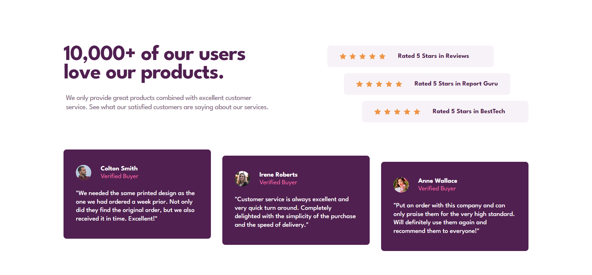

# Frontend Mentor - Social proof section solution

This is a solution to the [Social proof section challenge on Frontend Mentor](https://www.frontendmentor.io/challenges/social-proof-section-6e0qTv_bA). Frontend Mentor challenges help you improve your coding skills by building realistic projects. 

## Table of contents

- [Overview](#overview)
  - [The challenge](#the-challenge)
  - [Screenshot](#screenshot)
  - [Links](#links)
- [My process](#my-process)
  - [Built with](#built-with)
  - [Continued development](#continued-development)
- [Author](#author)

## Overview

### The challenge

Users should be able to:

- View the optimal layout for the section depending on their device's screen size

### Screenshot

### Links

- Solution URL: [https://www.frontendmentor.io/solutions/social-proof-section-pixel-perfect-with-grid-layout-9yLUE6zqy9](https://www.frontendmentor.io/solutions/social-proof-section-pixel-perfect-with-grid-layout-9yLUE6zqy9)
- Live Site URL: [https://sircarloschaves.github.io/social-proof-section/](https://sircarloschaves.github.io/social-proof-section/)

## My process

### Built with

- Semantic HTML5 markup
- CSS custom properties
- Flexbox
- CSS Grid
- Mobile-first workflow

### Continued development

I want to continue improving my practical knowledge with grid layout.

I will continue building landing page layouts to improve use cases.

## Author

- Github - [sircarloschaves](https://github.com/sircarloschaves)
- Frontend Mentor - [@sircarloschaves](https://www.frontendmentor.io/profile/sircarloschaves)
- Twitter/X - [@carloschavesdev](https://twitter.com/carloschavesdev)
